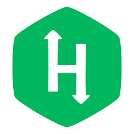

  

## Hello there! :wave:

I love coding, learning and experimenting. Always looking forward to the next challenge and improving on what I do. Currently enrolled in a coding bootcamp, looking for a job and working on my skillset to be a better software engineer.

 

---

 

## I am currently working on :man_technologist:

 

- Building a fullstack app using the MERN stack - <a href="https://github.com/Abraomukas/brown-gazelles-final-project">Tinder for doggos</a>

- Building a fullstack app using the MERN stack - <a href="https://github.com/Abraomukas/what-2-play">What2Play</a>

- Getting a golden badge in Java on HackerRank

- Getting a golden badge in Python on HackerRank

- Getting a golden badge in JavaScript on HackerRank

 

---

 

## :wrench: Technologies and tools I use

 

 

---

 

## GitHub stats :bar_chart:

 

 

---

 

## Fun facts: :grin:   

 

- My body runs on sugar. Especially chocolate M&M's. 
- I am obsessed with adidas.

 

---